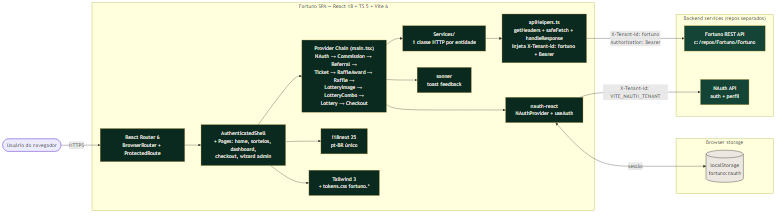

# fortuno-app — Plataforma de Sorteios Online em React


## Overview

**fortuno-app** é o frontend SPA da plataforma **Fortuno** — uma plataforma online de sorteios (loterias privadas) que cobre todo o fluxo público (home, listagem de sorteios, página institucional, antifraude), o fluxo de compra com PIX (seleção/aleatório + QR Code + polling de status), a área autenticada do usuário (dashboard, meus números, meus pontos, meus sorteios) e o wizard administrativo de 8 etapas para criar/editar uma loteria. Construído em **React 18 + TypeScript 5 + Vite 6**, com **Tailwind CSS** para estilização e **`nauth-react`** para 100% do fluxo de autenticação.

Este repositório contém **apenas o frontend**. A API REST do Fortuno fica em um repositório separado (`c:\repos\Fortuno\Fortuno`) e a coleção Bruno com os contratos vive em `c:\repos\Fortuno\Fortuno\bruno`. O serviço de autenticação é o **NAuth**, consumido como pacote (`nauth-react`).

A arquitetura segue a **skill `/react-architecture`** do projeto: para cada entidade de domínio existe um quinteto canônico **Types → Service → Context → Hook → Provider**, com `Services/apiHelpers.ts` como **única porta** de saída HTTP, garantindo o header obrigatório `X-Tenant-Id: fortuno` em 100% das chamadas (SC-004).

---

## 🚀 Features

- 🎯 **Catálogo público de sorteios** — home, listagem com paginação, página de detalhe com hero, regras, política de privacidade e prêmios.
- 🛒 **Checkout com PIX** — seleção manual ou aleatória de números, geração de QR Code, polling de status com backoff exponencial e simulador π de pagamento (mock).
- 👤 **Área autenticada** — dashboard, meus números (vouchers), meus pontos (saldo + extrato), meus sorteios (histórico) e gestão de conta via componentes `nauth-react`.
- 🧙 **Wizard administrativo de 8 etapas** — criação/edição de loteria (dados básicos, formato, descrições, imagens, combos, sorteios, prêmios, ativação), com persistência de progresso em `sessionStorage`.
- 🔐 **Autenticação via NAuth** — login, cadastro, esqueci-senha, alteração de senha e edição de perfil 100% em componentes da lib (sem telas custom — SC-007).
- 🌐 **Multi-tenant por header** — `X-Tenant-Id: fortuno` injetado em todas as requisições pela camada `apiHelpers`.
- 🧱 **Provider chain de 9 entidades** — Commission, Referral, Ticket, RaffleAward, Raffle, LotteryImage, LotteryCombo, Lottery, Checkout — todas seguindo o mesmo padrão de loading/error/toast.
- 🎨 **Identidade visual canônica** — paleta `fortuno.*` (verde profundo, dourado intenso/suave, off-white) em `tokens.css`, fontes Inter + Playfair Display, dezenas de keyframes/animations sob medida.
- 📝 **Markdown rico** — render de regras, política de privacidade e descrições editoriais via `react-markdown` + `remark-gfm`, com geração de PDF cliente via `jspdf`.
- 🌍 **i18n pt-BR** — namespace único `fortuno` em `i18next`, pronto para extensão.
- 🔔 **Feedback uniforme** — `sonner` para toasts (sucesso/erro) com `richColors` no canto superior direito.

---

## 🛠️ Technologies Used

### Core Framework
- **React 18.3** — UI declarativa, Suspense, StrictMode
- **TypeScript 5.6** (strict, `noUnusedLocals`, `noUnusedParameters`, `forceConsistentCasingInFileNames`) — tipagem estática rígida
- **Vite 6** — bundler/dev server (porta 5173, alias `@/` → `src/`)
- **React Router 6** — roteamento SPA com `BrowserRouter` + `ProtectedRoute`

### Authentication
- **`nauth-react` ^0.2.7** — `NAuthProvider`, `useAuth`, telas de login/cadastro/senha/perfil. Storage key canônica: `fortuno:nauth`.

### Styling
- **Tailwind CSS 3.4** + **`tailwindcss-animate`** (exigido por `nauth-react`)
- **Tokens canônicos** em `src/styles/tokens.css` — cores `fortuno.*`, sombras `noir-*` / `gold-*`, gradientes e ~30 animações sob medida
- **Fontes** — Inter (sans), Playfair Display (display)

### Internationalization
- **i18next 25** + **react-i18next 15** — locale `pt-BR` (única ativa), namespace `fortuno`

### HTTP & Utilitários
- **Fetch API nativa** (única forma permitida em novos services — Princípio II)
- **`sonner`** — toasts
- **`react-markdown` + `remark-gfm`** — render de Markdown
- **`@uiw/react-md-editor`** — editor de Markdown no wizard admin
- **`keen-slider`** — carousel de sorteios e imagens
- **`qrcode.react`** — fallback de QR Code (o principal vem do backend como `brCodeBase64`)
- **`jspdf`** — geração client-side de PDF de regras/política
- **`lucide-react`** — ícones

### Testing
- **Vitest 2** — unit tests com `globals: true`, ambiente `jsdom`
- **`@testing-library/react`** + **`@testing-library/jest-dom`** + **`@testing-library/user-event`** — testes de componentes
- **MSW 2** — mocks de rede em testes
- **Coverage** — provider `v8`

### DevOps
- **GitHub Actions** — `Version and Tag` (GitVersion 5.x) → `Create Release` (gh release com release notes auto-geradas)
- **GitVersion** — `mode: ContinuousDelivery`, branches main/develop/feature/release/hotfix, prefixo de tag `v`

### Workflow / Spec
- **Speckit** (`.specify/`) — `constitution.md` v1.0.0 + templates (plan/spec/tasks) + scripts PowerShell
- **Skills locais** (`.claude/skills/`) — `react-architecture`, `react-modal`, `react-alert`, `add-react-i18n`, `frontend-design`, `mermaid-chart`, `doc-manager`, `readme-generator`

---

## 📁 Project Structure

```
fortuno-app/
├── src/
│   ├── Services/                  # uppercase S — HTTP clients (Princípio III)
│   │   ├── apiHelpers.ts          # SINGLE SOURCE OF TRUTH — getHeaders, safeFetch, handleResponse, apiUrl
│   │   ├── lotteryService.ts      # 1 classe por entidade
│   │   ├── lotteryComboService.ts
│   │   ├── lotteryImageService.ts
│   │   ├── raffleService.ts
│   │   ├── raffleAwardService.ts
│   │   ├── ticketService.ts
│   │   ├── referralService.ts
│   │   ├── commissionService.ts
│   │   ├── pdfService.ts          # geração de PDF client-side
│   │   └── __tests__/             # testes unitários do apiHelpers
│   ├── Contexts/                  # uppercase C — Provider + Context por entidade
│   │   ├── LotteryContext.tsx
│   │   ├── LotteryComboContext.tsx
│   │   ├── LotteryImageContext.tsx
│   │   ├── RaffleContext.tsx
│   │   ├── RaffleAwardContext.tsx
│   │   ├── TicketContext.tsx
│   │   ├── ReferralContext.tsx
│   │   ├── CommissionContext.tsx
│   │   └── CheckoutContext.tsx
│   ├── hooks/                     # lowercase — useLottery, useTicket, useCheckout, useTenantHeader, ...
│   ├── types/                     # lowercase — interfaces Info/InsertInfo/UpdateInfo + enums
│   ├── pages/
│   │   ├── public/                # HomePage, LotteryListPage, LotteryDetailPage, AboutPage, ContactPage
│   │   ├── auth/                  # Login/Register/ForgotPassword/ResetPassword/ChangePassword/ProfileEdit
│   │   ├── dashboard/             # DashboardPage, MyNumbersPage, MyPointsPage, MyLotteriesPage
│   │   ├── checkout/              # CheckoutPage
│   │   └── admin/                 # LotteryWizardPage + wizard-steps/Step1..Step8
│   ├── components/
│   │   ├── common/                # Modal, ConfirmModal, Pagination, LoadingSpinner, CountdownTimer, ...
│   │   ├── layout/                # AuthenticatedShell, Footer, UserMenu
│   │   ├── route-guards/          # ProtectedRoute (consome useAuth)
│   │   ├── lottery/               # LotteryHero, PrizesGrid, ComboPackCard, Receipt, modals/...
│   │   ├── checkout/              # CheckoutStepper, ChooseNumberModal, PixStep, SuccessStep, ...
│   │   ├── dashboard/             # AvatarFrame, LinkedStatCard, MyLotteriesPreview, LotteryRow, ...
│   │   ├── tickets/               # TicketCardPremium, TicketDetailModal, TicketsGrid, ...
│   │   ├── home/                  # StatsBand, HeroFeaturedLottery, LotteryCarouselPremium, ...
│   │   ├── about/, contact/, points/, wizard/
│   ├── styles/
│   │   ├── tokens.css             # variáveis CSS canônicas (paleta fortuno.*)
│   │   ├── index.css              # entrada global
│   │   └── *.css                  # por-página (dashboard, lottery-detail, checkout, ...)
│   ├── i18n/
│   │   ├── index.ts               # init i18next, ns 'fortuno'
│   │   └── locales/pt/fortuno.json
│   ├── utils/                     # currency, datetime, getInitials, lotteryIcon
│   ├── App.tsx                    # <Routes> — rotas auth ficam fora do AuthenticatedShell
│   ├── main.tsx                   # provider chain + NAuthProvider + BrowserRouter + Toaster
│   └── test-setup.ts              # setup vitest + jest-dom
├── specs/
│   └── 001-fortuno-frontend/      # spec.md, plan.md, research.md, data-model.md, contracts/, quickstart.md
├── .specify/
│   ├── memory/constitution.md     # v1.0.0 — princípios I–VI
│   ├── templates/                 # plan/spec/tasks/checklist/constitution
│   └── scripts/powershell/        # setup-plan, create-new-feature, check-prerequisites, ...
├── .claude/
│   ├── commands/                  # speckit.specify, .plan, .tasks, .implement, .analyze, ...
│   └── skills/                    # react-architecture, react-modal, react-alert, mermaid-chart, ...
├── .github/workflows/             # version-tag.yml, create-release.yml
├── docs/                          # documentação adicional + diagramas
├── public/                        # assets estáticos servidos pelo Vite
├── tailwind.config.js             # extends fortuno.* + animations sob medida
├── postcss.config.js
├── vite.config.ts                 # alias @/ → src/, porta 5173
├── vitest.config.ts               # globals, jsdom, setup-files, coverage v8
├── tsconfig.json                  # strict, paths @/*, types vite/client + vitest/globals
├── GitVersion.yml                 # ContinuousDelivery, prefix v
├── .env.production.example        # template de variáveis de ambiente
├── MOCKS.md                       # registro vivo de mocks aguardando endpoints reais
├── CLAUDE.md                      # guia para Claude Code (arquitetura + comandos)
├── LICENSE                        # MIT
└── README.md                      # este arquivo
```

### Ecosystem

| Projeto                  | Tipo        | Localização                          | Descrição                                                  |
|--------------------------|-------------|--------------------------------------|------------------------------------------------------------|
| **fortuno-app**          | SPA (este)  | `c:\repos\Fortuno\fortuno-app`       | Frontend React consumindo a API Fortuno                    |
| **Fortuno (backend)**    | REST API    | `c:\repos\Fortuno\Fortuno`           | API .NET com domínio de loterias, tickets, pagamentos      |
| **Bruno collection**     | API tests   | `c:\repos\Fortuno\Fortuno\bruno`     | Coleção Bruno (HTTP client) com os contratos canônicos     |
| **`nauth-react`**        | NPM package | `^0.2.7`                             | Componentes e provider de autenticação NAuth               |

#### Fluxo de dependência

```
Browser (usuário)
    │
    ▼
fortuno-app (SPA — React + Vite)
    ├──▶ nauth-react ──▶ NAuth API     (X-Tenant-Id: VITE_NAUTH_TENANT, Bearer)
    └──▶ apiHelpers.ts ──▶ Fortuno API (X-Tenant-Id: fortuno, Bearer NAuth)
```

---

## 🏗️ System Design

O diagrama abaixo ilustra a arquitetura de alto nível do **fortuno-app** — um SPA React que consome dois backends distintos (NAuth para auth, Fortuno para domínio) com `apiHelpers.ts` como porta única de saída HTTP:



**Componentes principais:**

- **React Router 6** + **`ProtectedRoute`** controlam a navegação. Rotas protegidas ficam aninhadas em `AuthenticatedShell`; rotas de auth (`/login`, `/cadastro`, `/esqueci-senha`, `/recuperar-senha`) ficam fora do shell com fundo dark dedicado.
- **Provider chain (`main.tsx`)** — 9 providers de domínio (Commission → Referral → Ticket → RaffleAward → Raffle → LotteryImage → LotteryCombo → Lottery → Checkout) aninhados dentro do `NAuthProvider`. Estado é local a cada provider — **sem state manager global**.
- **`Services/apiHelpers.ts`** — função `getHeaders()` injeta `X-Tenant-Id: fortuno` em 100% das chamadas (SC-004) e adiciona `Authorization: Bearer <token>` lendo o token NAuth de `localStorage["fortuno:nauth"]`. Wrapper `safeFetch` converte erros de rede em `ApiError(status=0)` com mensagem PT-BR.
- **`nauth-react`** gerencia sessão, exibe telas de auth e persiste o token em `localStorage` (chave `fortuno:nauth`).
- **Tailwind + tokens** — paleta `fortuno.*` definida em `src/styles/tokens.css` e estendida em `tailwind.config.js`.

> 📄 **Source:** o Mermaid editável fica em [`docs/system-design.mmd`](docs/system-design.mmd).

---

## 📖 Additional Documentation

| Documento | Descrição |
|-----------|-----------|
| [FRONTEND_STORE_TRANSPARENT_MIGRATION](docs/FRONTEND_STORE_TRANSPARENT_MIGRATION.md) | Plano de migração frontend para a remoção de `storeId` exposto pela API de Lotteries (mudança breaking pendente). |
| [FRONTEND_TICKET_NUMBER_FORMAT_MIGRATION](docs/FRONTEND_TICKET_NUMBER_FORMAT_MIGRATION.md) | Plano de migração do formato unificado de número de ticket e faixas por `NumberType` (3 mudanças breaking nos contratos de Tickets/Lotteries). |
| [CLAUDE.md](CLAUDE.md) | Guia operacional para o Claude Code — comandos, arquitetura, convenções constitucionais, env vars. |
| [MOCKS.md](MOCKS.md) | Registro vivo de mocks aguardando endpoints reais no backend. |
| [Constituição do projeto](.specify/memory/constitution.md) | Princípios I–VI (skill obrigatória, stack fixa, casing inviolável, convenções, autenticação, env vars). |
| [Spec da feature ativa](specs/001-fortuno-frontend/) | `spec.md`, `plan.md`, `research.md`, `data-model.md`, `contracts/api-endpoints.md`, `quickstart.md`. |

---

## ⚙️ Environment Configuration

Antes de subir o dev server, configure as variáveis de ambiente:

### 1. Copie o template

```bash
cp .env.production.example .env
```

### 2. Edite o arquivo `.env`

```bash
# Base da API REST do Fortuno (sem barra final é tolerado — apiHelpers normaliza)
VITE_API_URL=https://api.fortuno.example.com

# Tenant ID injetado em X-Tenant-Id em 100% das chamadas Fortuno (SC-004)
VITE_FORTUNO_TENANT_ID=fortuno

# Base da API NAuth (autenticação)
VITE_NAUTH_API_URL=https://nauth.example.com

# Tenant do NAuth (config separada do tenant Fortuno acima)
VITE_NAUTH_TENANT=your_nauth_tenant_id_here

# Basename do BrowserRouter (use "/" para deploy na raiz)
VITE_SITE_BASENAME=/

# Links sociais e contato exibidos no Footer / contato
VITE_WHATSAPP_URL=https://wa.me/55XXXXXXXXXXX
VITE_INSTAGRAM_URL=https://instagram.com/fortuno
VITE_CONTACT_EMAIL=contato@fortuno.example.com
```

⚠️ **IMPORTANTE**:
- O arquivo `.env` (e `.env.production`) está no `.gitignore` — **nunca** comite credenciais reais.
- Apenas `.env.production.example` deve ir para o controle de versão.
- Toda env var exposta ao bundle **DEVE** ter prefixo `VITE_` (Princípio VI da constituição). Outros prefixos viram `undefined` em runtime.

---

## 🔧 Manual Setup

### Pré-requisitos
- **Node.js 20+** (compatível com Vite 6)
- **npm 10+** (ou pnpm/yarn — `package.json` não declara packageManager)
- **API Fortuno** rodando localmente ou disponível via HTTPS (repositório `c:\repos\Fortuno\Fortuno`)
- **NAuth API** acessível (URL definida em `VITE_NAUTH_API_URL`)

> 🚫 **Docker não é suportado neste repositório.** A constituição (Princípio II) proíbe a criação de `docker-compose.yml` ou execução de `docker` / `docker compose` no ambiente local.

### Setup

#### 1. Clone e instale dependências

```bash
git clone https://github.com/emaginebr/fortuno-app.git
cd fortuno-app
npm install
```

#### 2. Configure o `.env`

```bash
cp .env.production.example .env
# edite .env com as URLs reais da API Fortuno e NAuth
```

#### 3. Rode o dev server

```bash
npm run dev
# Vite sobe em http://localhost:5173
```

#### 4. Build de produção

```bash
npm run build       # tsc -b && vite build → gera dist/
npm run preview     # serve dist/ localmente para smoke test
```

---

## 🧪 Testing

Stack: **Vitest 2** + **Testing Library** + **jsdom** (config em `vitest.config.ts`, setup em `src/test-setup.ts`).

### Comandos

| Ação                           | Comando                                                       |
|--------------------------------|---------------------------------------------------------------|
| Watch (default do `npm test`)  | `npm test`                                                    |
| One-shot (CI)                  | `npx vitest run`                                              |
| UI interativa do vitest        | `npm run test:ui`                                             |
| Cobertura (provider v8)        | `npm run test:coverage`                                       |
| Arquivo único                  | `npx vitest run src/Services/__tests__/apiHelpers.test.ts`    |
| Filtro por nome do teste       | `npx vitest run -t "injeta X-Tenant-Id"`                      |
| Typecheck (sem rodar testes)   | `npm run typecheck`                                           |

### Onde ficam os testes

```
src/
├── Services/__tests__/          # testes unitários da camada HTTP (apiHelpers, getHeaders, safeFetch)
└── components/<area>/__tests__/ # testes de componente (ex.: ComboSelector)
```

`vitest.config.ts` exclui `src/pages/auth/**` da cobertura (lá só há composições de componentes do `nauth-react`).

---

## 🔒 Security Notes

### Camada HTTP (`apiHelpers.ts`)
- **Header obrigatório `X-Tenant-Id: fortuno`** em 100% das chamadas (SC-004) — fail-fast se alguém usar `fetch` direto.
- **Token NAuth** lido de `localStorage["fortuno:nauth"]` (com fallbacks de chave) e enviado como `Authorization: Bearer <token>`. 401 → `UnauthenticatedError` → redirect para `/login` via `ProtectedRoute`.
- **`safeFetch`** isola erros de rede (CORS, DNS, timeout) em `ApiError(status=0)` para evitar `TypeError: Failed to fetch` vazando como exceção genérica.

### Bundle / segredos
- **Sem secrets no bundle.** Apenas variáveis prefixadas `VITE_` chegam ao client (Princípio VI).
- **Connection strings, chaves privadas, SECRET_KEY** ficam server-side. O frontend só vê URLs públicas e tenant IDs.

### Autenticação
- **100% via `nauth-react`** — proibido criar telas custom de auth (SC-007).
- **Sem armazenamento em cookies** — token apenas em `localStorage`, sob a chave canônica `fortuno:nauth`.

---

## 🔄 CI/CD

### GitHub Actions

Dois workflows em `.github/workflows/`:

#### `version-tag.yml` — Version and Tag

**Triggers:**
- Push em `main`
- Disparo manual (`workflow_dispatch`)

**Steps:**
1. Checkout com `fetch-depth: 0` (necessário para GitVersion).
2. Instala GitVersion 5.x.
3. Calcula a versão a partir de `GitVersion.yml` (mode `ContinuousDelivery`, branches main/develop/feature/release/hotfix).
4. Cria e empurra a tag `v<NuGetVersionV2>` se ela ainda não existir.

**Convenções de bump por commit message:**
- `major:` / `breaking:` → bump MAJOR
- `feat:` / `feature:` / `minor:` → bump MINOR
- `fix:` / `patch:` → bump PATCH
- `+semver: none|skip` → não incrementa

#### `create-release.yml` — Create Release

**Trigger:** conclusão bem-sucedida do workflow `Version and Tag`.

**Comportamento:**
- Compara a tag mais recente com a anterior.
- **Se a versão MINOR ou MAJOR mudou** (ou se é a primeira tag), cria um GitHub Release com `gh release create … --generate-notes`.
- **Se for apenas patch**, pula a criação do release.

---

## 🤝 Contributing

Pull requests são bem-vindas. Antes de abrir, confira o checklist constitucional do projeto.

### Setup de desenvolvimento

1. Fork do repositório.
2. Crie uma branch a partir de `main` (`git checkout -b feature/nome-da-feature` ou `001-feature-slug` para alinhar com o speckit).
3. Implemente seguindo a stack e convenções abaixo.
4. Rode `npm run typecheck` e `npm test` antes do commit.
5. Use mensagens convencionais (`feat:`, `fix:`, `refactor:`, `docs:`, `chore:`) — o GitVersion depende disso para incrementar a versão.
6. Abra PR contra `main`.

### Coding standards (Constitution v1.0.0)

- **Princípio I (não-negociável):** novas entidades de domínio são scaffoldadas via skill `/react-architecture`. Não reimplementar Types/Service/Context/Hook manualmente.
- **Princípio III (inviolável):** casing literal de diretórios — `Contexts/`, `Services/` (uppercase) e `hooks/`, `types/` (lowercase). Imports devem bater exato (Linux/CI quebra; Windows mascara).
- **Princípio IV:** `interface` (não `type` para objetos), arrow functions, `const` por padrão, PascalCase / camelCase / UPPER_CASE.
- **Princípio VI:** env vars frontend usam prefixo `VITE_` e são lidas via `import.meta.env.VITE_*`. Nunca `REACT_APP_`.
- **Stack fixa:** sem Redux/Zustand/MobX (Context API é o padrão); novos services HTTP usam Fetch API; Axios fica apenas em código legado.
- **HTTP via `apiHelpers`:** nunca chame `fetch` direto a partir de um service — use `safeFetch` + `handleResponse` para garantir tenant header e tratamento padronizado de erros.
- **Mocks:** crie um mock APENAS quando detectar endpoint faltando durante a implementação; marque com `// MOCK: aguarda endpoint <path>` e registre em `MOCKS.md`.

Documento completo: [`.specify/memory/constitution.md`](.specify/memory/constitution.md).

---

## 👨‍💻 Author

Desenvolvido por **[Emagine](https://github.com/emaginebr)**.

---

## 📄 License

Este projeto é licenciado sob a **MIT License** — veja o arquivo [LICENSE](LICENSE) para detalhes.

Copyright (c) 2026 Emagine.

---

## 🙏 Acknowledgments

- Construído com [React](https://react.dev), [TypeScript](https://www.typescriptlang.org/) e [Vite](https://vite.dev).
- Estilo via [Tailwind CSS](https://tailwindcss.com) + `tailwindcss-animate`.
- Autenticação ponta-a-ponta via [`nauth-react`](https://www.npmjs.com/package/nauth-react).
- Toasts com [`sonner`](https://sonner.emilkowal.ski/).
- Markdown via [`react-markdown`](https://github.com/remarkjs/react-markdown) + [`remark-gfm`](https://github.com/remarkjs/remark-gfm).
- Versionamento automatizado com [GitVersion](https://gitversion.net/).
- Workflow de spec-first com [Speckit](https://github.com/github/spec-kit).

---

## 📞 Support

- **Issues:** [GitHub Issues](https://github.com/emaginebr/fortuno-app/issues)
- **Pull Requests:** [GitHub PRs](https://github.com/emaginebr/fortuno-app/pulls)
- **Releases:** [GitHub Releases](https://github.com/emaginebr/fortuno-app/releases)

---

**⭐ Se este projeto te ajudou, considere dar uma estrela!**
